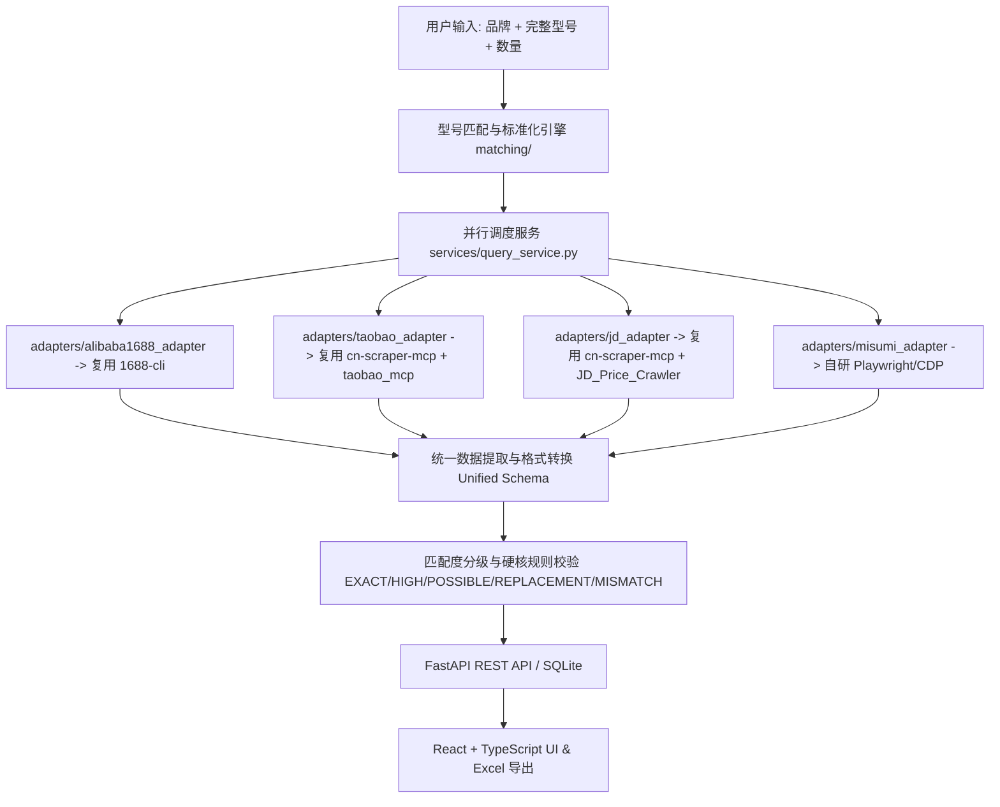

# 上游开源项目技术评估与复用方案 (UPSTREAM_EVALUATION.md)

本文档对选定的 5 个开源项目进行实测分析与评估，并确定在本项目中的具体复用方式与适配接入方案。

---

## 1. `cn-scraper-mcp` (GoesByhc)
- **核心定位**: 基于 Playwright / Chrome CDP 与 Cookie 提取的多平台采集引擎。
- **技术栈**: Python 3.10+, Playwright, DevTools Protocol (CDP), FastMCP
- **评估结论**: **强烈推荐复用 (用于 淘宝/京东 登录态与底座控制)**
- **详细复用点**:
  1. `cn_scraper_mcp/auth.py`: 提供通用的浏览器 Profile 创建与管理，可通过独立 `--user-data-dir` 启动专用 Chrome 实例。
  2. `cn_scraper_mcp/cookie_harvest.py`: 提供安全的登录态提取逻辑，将 Cookie 保存到本地隔离存储。
  3. `cn_scraper_mcp/engines/cdp.py`: 封装了 CDP 连接，支持拦截并分析网页网络数据包 (如 MTOP 接口)。
  4. `cn_scraper_mcp/engines/taobao.py` & `jd.py`: 可直接作为 `taobao_adapter` 和 `jd_adapter` 的网络与 DOM 交互底座。
- **适配方案**: 在 `adapters/taobao_adapter` 和 `adapters/jd_adapter` 中以 Python 包模块形式引入底座逻辑，结合自定义的工业型号抽取规则。

---

## 2. `1688-cli` (superjack2050)
- **核心定位**: 面向 1688 平台的命令行与 MCP 接口工具，专为 B2B 采购场景设计。
- **技术栈**: Node.js / TypeScript, Playwright
- **评估结论**: **强烈推荐复用 (作为 1688 平台核心适配器引擎)**
- **详细复用点**:
  1. 1688 搜索与商品 JSON/JSONL 数据格式解析。
  2. 阶梯价 (Tier Price, 如 1-99件 ￥50, 100+件 ￥45) 的完整解析能力。
  3. 供应商资质字段提取 (工厂/贸易商、诚信通年限、注册资本、地理位置)。
- **适配方案**:
  - `backend` (FastAPI) 通过 subprocess 调用 `1688-cli` 生成 JSON 输出，或封装为标准 CLI 桥接适配器 `adapters/alibaba1688_adapter.py`。

---

## 3. `taobao_mcp` (JeremyDong22)
- **核心定位**: 淘宝商品页采集与 MCP 插件。
- **技术栈**: Python, Playwright
- **评估结论**: **参考复用 (作为 淘宝详情页与 SKU 解析的补充方案)**
- **详细复用点**:
  - `taobao_scraper.py`: 补充提取淘宝详情页多规格 SKU（尺寸、轴承游隙、密封圈等）。
  - 针对搜索列表抓取的二次校验。

---

## 4. `JD_Price_Crawler` (JeremyDong22)
- **核心定位**: 京东价格采集器。
- **技术栈**: Python, Selenium / Playwright
- **评估结论**: **参考复用 (用于 京东 SKU 与工业品规格校验)**
- **详细复用点**:
  - 京东商品详情页中自营 / 授权专卖店的身份识别逻辑。
  - SKU 联动价格提取算法。

---

## 5. `PriceDive` (DAILtech)
- **核心定位**: 历史价格监控与降价提醒系统。
- **技术栈**: Python, SQLite, HTML Templates
- **评估结论**: **架构参考 (作为 阶段6 价格监控模块)**
- **详细复用点**:
  - 历史价格快照与走势数据表结构设计 (sqlite schema)。
  - 定时轮询 (APScheduler) 降价提醒告警逻辑。

---

## 6. 米思米 (Misumi China) 自研适配器说明
- **现状分析**: GitHub 上暂无现成稳定的米思米中国站 (`misumi.com.cn`) 工业品采集项目。
- **自研方案**:
  - 在 `adapters/misumi_adapter.py` 中基于 Playwright / CDP 开发自研适配器。
  - 支持米思米账号登录态维持、品牌+订购码 (型号) 搜索、尺寸参数配置校验、协议价/目录价区分、交期与阶梯价提取。

---

## 总结：总体技术路线图

